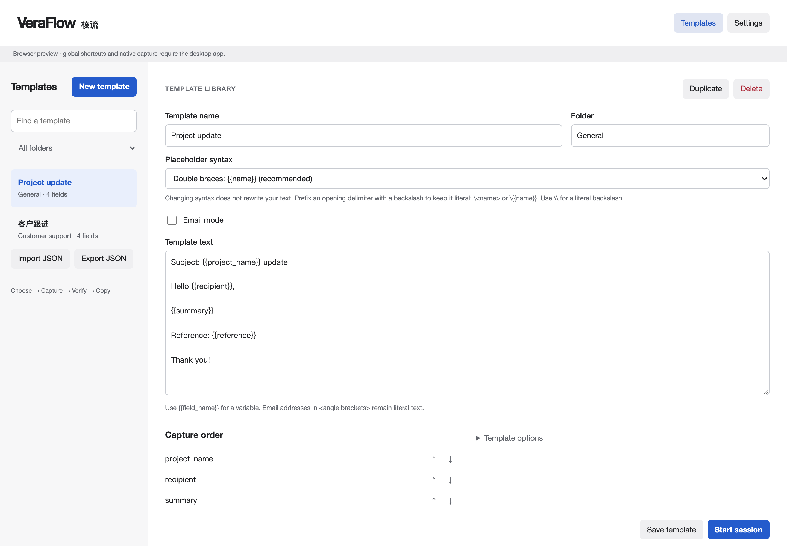

# VeraFlow 核流

A local, keyboard-driven desktop utility for turning reusable templates into verified text. Choose a template, capture each value from another app, verify against the original, and copy the finished snippet.

Built for macOS and Windows with Tauri 2, Rust, and TypeScript. No account, analytics, or AI service. The app contacts GitHub for update checks and downloads; template and session values stay local. Preview binaries use verified updater signatures but do not yet have Apple notarization or Windows publisher signing. Native runtime acceptance remains incomplete.



## Download

Get the [v0.5.1 preview binaries](https://github.com/iandorsey00/veraflow/releases/tag/v0.5.1): macOS Apple Silicon (`macos-arm64.zip`), macOS Intel (`macos-x64.zip`), or Windows x64 (`windows-x64-setup.exe`). Verify downloads against the release’s `SHA256SUMS.txt`. No Node.js or Rust installation is needed to use these binaries.

On macOS 12+, extract the ZIP and move VeraFlow.app to Applications. The preview is not Developer ID signed or notarized; macOS may block opening it. Use the per-app Open Anyway option in Privacy & Security only if you trust the download. Grant Accessibility permission there for source-text capture. On Windows, run the installer; it may show an unrecognized-publisher warning and install WebView2 if missing. Do not disable system-wide security protections.

Back up `library.json` before upgrading. See [release and rollback instructions](docs/release.md) and [preview limitations](docs/binary-release-notes.md).

## Run

Requirements: Node.js 22.12+ (tested with 24), current stable Rust, and platform build tools. macOS requires Xcode Command Line Tools; Windows requires Visual Studio Build Tools with Desktop development with C++ and WebView2. See [Tauri prerequisites](https://v2.tauri.app/start/prerequisites/).

```sh
npm ci
npm run desktop
```

For a browser-only UI preview: `npm run dev`. Preview libraries are memory-only and reset on refresh. Global shortcuts, native capture, tray, login items, and filesystem storage require the desktop app.

```sh
npm test
npm run check
npm run test:ui           # first run: npx playwright install chromium
cargo test --manifest-path src-tauri/Cargo.toml
cargo clippy --manifest-path src-tauri/Cargo.toml -- -D warnings
npm run desktop:build    # unsigned local platform bundle
```

macOS bundles appear under `src-tauri/target/release/bundle/`. Windows builds produce MSI/NSIS bundles on Windows. Release signing/notarization certificates are intentionally not included. CI checks both platforms. Version tags run the release workflow, which packages three binaries, verifies uploaded checksums, and publishes an unsigned GitHub prerelease.

## Workflow

1. Create or edit a template with placeholders such as `{{ticket_number}}`, `{{客户姓名}}`, or `{{地址}}`. Repeated names share a field. Use a folder label to organize templates, and arrow buttons to change capture order.
2. Start a session. The same window becomes a small, resizable, always-on-top panel. Return to the source app and select text.
3. Press the capture shortcut. The panel stores the text and advances. You can also paste/type manually, or copy in the source app and choose **Use clipboard**. Cmd/Ctrl+Enter opens manual entry or submits and advances. Alt+Left/Right moves to the previous/next field within VeraFlow.
4. After the last field, verification starts if enabled. Select each original value again and press the verification shortcut. A mismatch shows both values and emphasizes the differing span; it never overwrites the captured value.
5. Preview if desired, then choose **Copy result** or use the finish shortcut. Values are erased by default after successful copying. Skipped fields render as empty text.

With a template selected, **Cmd/Ctrl+Enter** starts its session. Use Tab/Shift+Tab and Enter/Space to operate the remaining controls. In Settings → Verification, **Green background for verified fields** optionally colors each verified field as it passes (off by default).

Default global shortcuts use **Cmd/Ctrl+Shift+1…8**: capture, previous, next, clear, skip, verify/start verification, cancel, and finish. All are configurable in Settings, registered only during sessions, and paused while the template/settings screen is shown. A registration conflict identifies the action and combination; a new session still opens with global shortcuts disabled for that session. Use manual entry, clipboard, or the mouse panel. Settings offers an alternate Cmd/Ctrl+Alt+Shift preset, a global-shortcut toggle, and blank combinations to disable individual actions. Capture can also verify during the verification pass. Capture and verification shortcuts always advance after success; the automatic advancement preference controls the manual buttons. Release shortcut modifiers promptly so copy/paste can run; VeraFlow waits up to three seconds and reports held keys separately. Cmd/Ctrl+Shift+N may already be assigned by the system or another application; use Cmd/Ctrl+Alt+N if that combination works on your machine. Registration conflicts cannot be overridden by VeraFlow.

The **Verify** shortcut starts the second pass when capture is complete; subsequent presses retrieve source text. Without automatic advancement, use next/previous and start verification explicitly. All populated fields must pass when verification is required. Clear a field to recapture it; corrections invalidate its verification. Cancellation, replacement, quitting an active session, and discarding unsaved changes require confirmation.

## Comparison

Comparison is deterministic and local. Newlines normalize CRLF and CR to LF. Optional NFC normalization handles canonically equivalent Unicode. Exact mode preserves spaces; whitespace mode trims and collapses whitespace, optionally preserving line boundaries. Case-insensitive comparison uses locale-independent Unicode lowercase, not language-specific case folding. Punctuation tolerance is off by default. Width variants, lookalikes (`0`/`O`), and fuzzy meanings do not match automatically. Comparison never transforms output values.

New templates use `{{name}}`; existing templates keep `<name>`. Choose either syntax per template; changing the setting does not rewrite the text. Names are case-sensitive Unicode runs excluding whitespace, controls, and delimiters. Braces preserve display-name addresses such as `Joe Smith <joe.smith@example.com>`. Escape an opening delimiter with a backslash (`\<literal>` or `\{{literal}}`); `\\` produces one literal backslash. Other backslashes are unchanged. Replacement is literal and never reparses inserted values.

## Architecture and storage

- `src/core/`: pure parsing, comparison, rendering, and session state.
- `src/main.ts`, `src/style.css`, `src/locales/`: keyboard-accessible DOM UI and English / Simplified Chinese resources.
- `src/platform.ts`: desktop boundary and explicitly limited browser preview.
- `src-tauri/src/`: typed local persistence, tray, lifecycle, and native capture bridge.
- `src-tauri/native/`: Objective-C macOS and Win32 C++ clipboard adapters.

[Architecture decision](docs/architecture.md) records the framework tradeoffs and use of `../guidelines`. [Privacy and security review](docs/privacy-security.md) describes the limits of clipboard restoration and in-memory privacy. [Validation](docs/validation.md) distinguishes automated checks from manual release gates.

Templates and preferences are stored as `library.json` under the OS app-data directory: `~/Library/Application Support/com.veraflow.desktop/` on macOS and `%APPDATA%\com.veraflow.desktop\` on Windows. Writes replace the file atomically, with restrictive permissions on macOS. An unreadable library fails closed instead of being overwritten. Back up this file while the app is closed; restore it with the app closed. Templates themselves may contain sensitive static text and are not encrypted by VeraFlow.

Session values, mismatch candidates, and rendered output are never written to application storage or logs. Session persistence is not offered; quitting always drops in-process data. Erasing references is not secure memory wiping, and OS swap/crash dumps or clipboard managers are outside the app's control.

## Platform limitations

- **macOS:** grant VeraFlow Accessibility permission in System Settings → Privacy & Security → Accessibility. Capture first reads accessible selected text. If unsupported, it sends Cmd+C, snapshots readable clipboard formats up to 32 MiB, and restores them if the clipboard is unchanged. macOS has no atomic pasteboard compare-and-swap, so restoration remains best effort. Some apps expose neither selection nor Copy.
- **Windows:** uses Ctrl+C fallback. It preserves supported global-memory formats and refuses unfamiliar formats before copying when restoration is enabled. Elevated/protected apps may block synthetic input. VeraFlow does not request administrator privileges.
- Clipboard history, Universal Clipboard/cloud clipboard, other clipboard managers, delayed-copy operations, secure input, or another app changing the clipboard can prevent reliable restoration. No copy-result provenance can be guaranteed against another process writing at exactly the same time. Errors leave the field unchanged and offer manual capture. If preservation prevents capture, turn off **Preserve clipboard for this session** in the capture panel, then retry the shortcut or Transfer. This explicitly lets capture replace the current clipboard. New sessions reset to the saved restoration preference.
- Global capture requires source focus. The optional session-only **Mouse transfer panel** remembers the most recent external application/window while enabled, restores its focus on Transfer, and captures the selection. It is off on each new session; no selected text is monitored. Drag the floating window beside your source and keep Always on top enabled. Apps that clear selection on focus changes may require the keyboard or clipboard route. Automatic popups beside selections are not implemented.
- No crash reporting or telemetry is configured. The operating system may independently collect crash information. No guarantee is made against force quit, power loss, OS dumps, or malicious local software.

## Screenshots

Run `npm run dev`, then `npm run portfolio:capture`. The capture script uses only synthetic browser-preview data. See [screenshot manifest](docs/portfolio/README.md).

## Releases

See [release notes](CHANGELOG.md) and [build, installation, and rollback instructions](docs/release.md). Version consistency is checked with `npm run check:version`.

## License and source

VeraFlow © 2026 Ian Dorsey. Open source under the [MIT license](LICENSE).

[View the repository on GitHub](https://github.com/iandorsey00/veraflow). The app also includes these details under Settings → About; the repository link opens your default browser.

## Email mode

Enable **Email mode** on a template to add Subject and To above the Body. Cc and Bcc have separate toggles and are off initially. Plain templates remain the default. Every enabled section accepts placeholders; repeated names share one captured and verified value. Disabled sections are excluded from capture and output. Subject and To must resolve to nonempty single-line text.

After capture and verification, choose **Prepare email output** (or press the configured finish shortcut once). Focus Subject in the destination email app. Press **Cmd/Ctrl+Shift+8** for each section: Subject → To → enabled Cc → enabled Bcc → Body. Each press pastes once and presses Tab; Body does not press Tab. **Cmd/Ctrl+Shift+2** sends Shift+Tab and returns to the previous section. These use the configurable finish and previous shortcuts. Returning does not undo pasted text: select existing text before repasting. VeraFlow never sends the email.

The destination must expose the same field order and optional fields; adjust focus manually when its Tab order differs. Output replaces the clipboard and does not restore it. Slow editors, recipient chips, or focus changes can prevent the intended result; inspect the destination before retrying any failed paste. **Next section (manual)** and **Previous section (manual)**, or Alt+Right/Left inside VeraFlow, change only VeraFlow’s section without sending Paste or Tab. The configured global Next shortcut (default Cmd/Ctrl+Shift+3) also advances manually while your email app stays focused. Use these after inspecting or manually filling a section if injection fails. At Body, manual Next enables finishing; this does not claim the body was pasted. Adjust destination focus yourself. After the Body, review your draft, return to VeraFlow, and use **Cmd/Ctrl+Enter** to finish and apply the session-erasure preference. Browser previews cannot inject keys into another app.

Older libraries load with email mode off. Back up `library.json` before saving email templates: older binaries reject the additional template property, so downgrading requires a compatible backup.

## Template exchange and updates

**Export JSON** saves saved templates only, including email sections, comparison settings, and placeholder style. It excludes captured session values and app preferences. **Import JSON** validates a versioned VeraFlow archive, previews template names for confirmation, and adds copies with fresh IDs without overwriting existing templates. Archives are limited to 16 MB and libraries to 1,000 templates. XML is not supported. Templates can themselves contain private literal text; review them before sharing.

Desktop startup checks once for a newer version without interrupting editing. When one is available, **Update now** appears on the main page. **Update app** in Settings also checks on demand. Review the version and release notes, then confirm to download, verify, install in place, and restart. Save or discard changes and finish or cancel any session first. Saved templates and settings stay in the app-data directory. There is no background installation, and a failed startup check stays quiet; use Settings to retry. Windows shows installer progress; macOS may request permission to replace the app. Install macOS builds in a stable writable location such as Applications.

Version 0.4.0 and earlier need one manual upgrade to 0.5.0 to gain this feature. The preview update feed is published only after all three platform packages pass signature and checksum verification. Update signatures verify package identity and version; they do not replace Apple notarization or Windows publisher signing, which remain unconfigured.

## Latest release: v0.5.1

Version 0.5.1 adds session-only clipboard recovery, individual verified-field backgrounds, manual email navigation, clearer confirmation actions, specific held-key/permission errors, and the main-page update action. Version 0.5.0 users can install this release through Settings → Update app. Earlier versions need a manual download.
